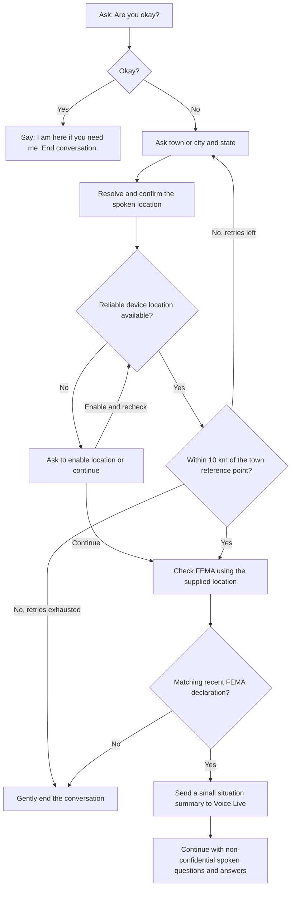

# CrisisConnect - Voice Crisis Chatbot

CrisisConnect is a voice-only chatbot. It checks wellbeing, asks for a broad location, compares it with device location when available, checks FEMA declarations, and then continues a supportive voice conversation. It does not ask for confidential information.

## Start a local demo

Demo mode opens without Azure credentials or `config.json`. It supports basic, scripted **voice chat on your computer**, with no Census, FEMA, device-location, or cloud calls. It is a conversation demo, not a disaster-verification simulation or a local language model.

Windows CMD (one-time setup, then launch):

```cmd
scripts\win\setup_demo.cmd
scripts\win\start_demo.cmd
```

For later launches, run only `scripts\win\start_demo.cmd`. Windows uses its installed English (US) desktop speech recognizer and system voice. If recognition is unavailable, install the English (US) speech language component in Windows Settings. The setup script installs the microphone dependency into `venv`.

Linux Bash:

```bash
# Debian/Ubuntu system prerequisites, installed once:
sudo apt install python3-venv python3-tk libportaudio2 espeak-ng curl unzip
bash scripts/linux/setup_demo.sh
bash scripts/linux/start_demo.sh
```

Linux setup downloads the small English Vosk model (about 40 MB) into `models/` and installs demo dependencies. Later launches use only `bash scripts/linux/start_demo.sh`, with no internet required. Speech uses the local Vosk model and eSpeak. [Vosk model details](https://alphacephei.com/vosk/models)

You can also launch directly with `venv\Scripts\python.exe main.py --demo` on Windows or `venv/bin/python main.py --demo` on Linux. The default launch without `--demo` remains live mode.

Select **Start conversation**, then **Record answer**, speak, and select **Finish answer**. Try “hello”, “I feel worried”, “my home flooded”, or “thank you”. Say **goodbye** or select **End conversation** to finish. Audio stays in memory and speech runs locally. The demo never asks for confidential information.

## Live conversation workflow



1. The first question is **Are you okay?** A yes ends the conversation with **I am here if you need me.** An unclear answer is clarified.
2. A no leads to a request for **town/city and state**, followed by spoken confirmation of the place found. No home address is requested.
3. The app reads device location with permission. If it is disabled, denied, unavailable, stale, or too inaccurate, the person can enable location and say **check again**, or say **continue** without device verification.
4. An available location must be within **10 km** of the town's public Census reference point. Mismatches trigger correction prompts. `LOCATION_MAX_RETRIES` defaults to **3 corrections after the initial attempt**. The conversation gently ends after those retries fail. Unresolved or rejected place names use the same correction budget.
5. The app checks **OpenFEMA Disaster Declarations Summaries v2** for the resolved county, including statewide declarations. No matching recent declaration leads to a gentle exit. A failed service request is an error that can be retried; it is never treated as evidence of no disaster.
6. After a matching declaration, the app sends Voice Live a small summary: the person reports not being okay, the public area name, whether device location matched, and the FEMA incident details. Exact device coordinates are excluded.
7. Voice Live selects relevant questions from reviewed prompts about the situation, shelter, food/water, whether others are present, and practical support. It cannot invent requests for confidential information. The conversation ends after these topics or when the person says **stop**.

Use **Start conversation**, then **Record answer** and **Finish answer** for each turn. **Repeat question** does not advance the flow. Recordings have a 30-second limit. **End conversation** clears the session; it closes the conversation, not the desktop application.

**Speech before FEMA verification:** the current implementation uses Voice Live for transcription and reading fixed prompts in steps 1-4. The AI-guided conversation and situation-summary request begin only after FEMA verification. Fully local initial speech is not implemented.

## Configuration

Edit `config.json` in the project root before starting:

```json
{
  "AZURE_VOICELIVE_ENDPOINT": "https://YOUR-RESOURCE.services.ai.azure.com",
  "AZURE_VOICELIVE_MODEL": "gpt-4.1-mini",
  "AZURE_VOICELIVE_API_VERSION": "2026-04-10",
  "AZURE_VOICELIVE_VOICE": "en-US-AvaNeural",
  "LOCATION_MAX_RETRIES": 3,
  "FEMA_LOOKBACK_DAYS": 30
}
```

Replace `YOUR-RESOURCE` with your resource name. Config values take precedence over environment variables because the voice app reads this file directly. Restart after changes. `LOCATION_MAX_RETRIES` accepts integers from 1 to 20; `FEMA_LOOKBACK_DAYS` accepts 1 to 365. The match radius is 10 km.

## Setup

Use Python 3.11+ with Tkinter, a microphone, headphones or speakers, Azure Voice Live access, and internet access to Census and FEMA. Install Azure CLI separately for `az login` and grant the signed-in account access to the Voice Live resource.

Windows CMD, from the project root:

```cmd
scripts\win\setup_venv.cmd
venv\Scripts\python.exe -m pip install -r requirements-live.txt
az login
scripts\win\start_chat.cmd
```

Windows location uses the operating system's `GeoCoordinateWatcher` through Windows PowerShell. Enable Location services and allow desktop location access in Windows privacy settings. If the OS cannot supply a fresh, sufficiently accurate fix, the chatbot offers the unverified-location path.

Linux Bash:

```bash
bash scripts/linux/setup_venv.sh
venv/bin/python -m pip install -r requirements-live.txt
bash scripts/linux/setup_location.sh
az login
bash scripts/linux/start_chat.sh
```

Linux location uses GeoClue over the system D-Bus. Install/enable GeoClue and your desktop's location permission agent, and allow location in privacy settings. `setup_location.sh` registers a desktop identifier for the permission request; it does not change system privacy settings. If the service or permission agent is unavailable, the chatbot offers the unverified-location path. On Debian/Ubuntu, audio and GUI support may also need `python3-venv`, `python3-tk`, and `libportaudio2`.

Setup creates `venv` in the project root. Activate it optionally with `call venv\Scripts\activate.bat` in CMD or `source venv/bin/activate` in Bash. All command scripts are under `scripts/win` and `scripts/linux`.

## Data and location limitations

- **FEMA declarations are not real-time hazard detection.** A missing declaration does not mean an area is safe, and a matching declaration does not establish that this person was affected or is eligible for assistance. The exit message reflects this distinction. [OpenFEMA dataset](https://www.fema.gov/openfema-data-page/disaster-declarations-summaries-v2)
- The configured recent-disaster rule matches incidents whose **start date** falls within the last `FEMA_LOOKBACK_DAYS` calendar days, with no future declaration date. It includes recently ended incidents and excludes older ongoing incidents. This is an application matching rule, not FEMA's definition of an active disaster.
- Town names and state codes are resolved with Census TIGERweb. Distance is calculated to the town's **public reference point**, not its boundary or a home address. A resident of a large town can be more than 10 km from that point. The county is the county containing the reference point; towns spanning multiple counties need finer geographic support before deployment. [Census place fields](https://tigerweb.geo.census.gov/arcgis/rest/services/TIGERweb/Places_CouSub_ConCity_SubMCD/MapServer/4)
- Only unambiguous Census incorporated places or census-designated places are currently supported. Say just the city/town and state, for example **Richmond, Virginia**. The flow does not use the old fictional scenarios or the former `--scenario` option.
- Device fixes older than two minutes or with reported accuracy worse than one kilometer are treated as unavailable. Exact device coordinates are used locally for distance comparison and are not sent to Census, FEMA, or Voice Live.
- Windows, GeoClue, permission agents, and location hardware vary. Actual device-location behavior and live Azure audio require testing on the deployment machine.

## Privacy

The chatbot never asks for names, identity numbers, contact details, home addresses, financial information, passwords, immigration information, or medical records. In live mode, public town/state names are sent to Census, public geographic codes are sent to FEMA, and Azure processes recorded audio and the conversation's redacted text. Demo mode processes speech locally and uses none of these services. Common identifiers are removed from transcribed text, but redaction cannot remove information already spoken into cloud-processed audio in live mode or guarantee removal of every personal detail. Do not volunteer confidential information.

Audio, device readings, and answers are held in memory. The application does not write conversation or location logs. Session state clears when the conversation ends. No email, SMS, action-plan, typed-chat, or dispatch feature is exposed.

## Tests and packaging

```cmd
venv\Scripts\python.exe -m unittest discover -s tests -v
scripts\win\build_windows.cmd
```

Build Windows executables on Windows. Copy the whole `dist\CrisisConnectDesktop` folder. The build script copies `config.json` beside the executable only if no config already exists there; edit that file for the target computer. Credentials are not bundled.

The workflow and service-contract tests use synthetic data. See [the test report](docs/TEST_REPORT.md) and [deployment checks](docs/DEPLOY_AND_TEST.md) for validation limits. Older assistance modules remain in the source tree for regression coverage but are not exposed by the voice chatbot.
