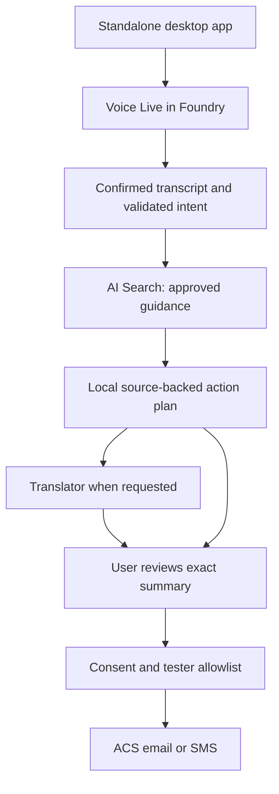

# Deploy and Test CrisisConnect Desktop

Version 0.1.0 · September 23, 2026

This runbook applies to the included standalone application. It creates no web/mobile frontend. You deploy the app to an operator's computer and provision its cloud services in Azure. The instructions have not been executed against your Azure subscription.

## A. Choose the operating mode

| Mode | Command | Use |
|---|---|---|
| Offline dummy | `python main.py --demo` | Competition walkthrough; no cloud calls or messages |
| Offline terminal drill | `python main.py --demo --headless --scenario flood` | Reproducible demonstration and test |
| Azure pilot | `python main.py --live` | Operator-authenticated integration testing |
| Search setup | `python main.py --live --seed-search` | Explicitly writes public guidance into the configured Azure Search index |

All `python` commands below can be replaced with `py -3` on Windows or the full path to the virtual environment's Python. Execute them from the extracted application directory. Do not use real survivor information during setup.

## B. How API communication works



### Implemented connections

| Service | Protocol / operation | Content sent |
|---|---|---|
| Voice Live / Foundry | WebSocket `2026-04-10`; transcription and response events | Recorded utterance, redacted request for need classification, or approved readback text |
| Translator | REST v3 text translation on a resource-specific endpoint | Approved summary text; URLs and key phone numbers protected with markers |
| AI Search | REST `2024-07-01` search and explicit index setup | Broad state/county filters; no raw transcript, ID, or delivery address |
| ACS email | Python Email SDK | User-approved plain-text message and allowed recipient |
| ACS SMS | Python SMS SDK | User-approved SMS and allowed recipient |

Authentication uses `DefaultAzureCredential`. For local testing, it can use your Azure CLI login. Voice Live receives a bearer token in an authorization header, not a URL. The endpoint, model, and API version are configured independently. [1–5]

The voice conversation is **turn-based**: record up to 30 seconds → transcribe → correct → submit → retrieve → review/read. Each cloud voice task opens a fresh connection; there is no always-on microphone or full-duplex barge-in. Context is retained only in the local session's structured needs. This design is appropriate for a bounded dummy/pilot, not a claim of a finished natural-conversation product.

## C. Azure preparation

### C1. Subscription, budget, and region

1. Use an Azure subscription you control and are authorized to charge.
2. Set a budget alert and note that an alert alone does not stop spending.
3. Create a development resource group, for example `rg-crisisconnect-desktop-dev`.
4. Choose a region where the selected Voice Live model is supported. Check the current matrix and quota rather than assuming that every model works in every region.
5. Record resource names, region, data-processing geography, owner, and limits in `PROJECT_TRACKER.md`. Do not record secrets.

### C2. Foundry / Voice Live

1. Create a Microsoft Foundry resource and project as appropriate for the current Azure portal.
2. Start with **direct-model Voice Live**. This release does not use Foundry Agent Service.
3. Select a supported model. The code defaults to `gpt-4.1-mini`; replace it if unsupported or unsuitable in your resource.
4. Copy the resource endpoint, for example `https://<resource>.services.ai.azure.com`. Use the resource root, not a project URL ending in `/api/projects/...`.
5. Grant the signed-in operator the permissions required by the current Voice Live API reference. That reference lists Cognitive Services User and Azure AI User; Azure AI User may appear as Foundry User after role renaming. Scope roles to the necessary resource/project.
6. Confirm the official quickstart works with synthetic speech before debugging this app.

Direct natively supported Voice Live models are managed by the service; a separate audio-model deployment is not required for this mode. Agent Service is a later architectural choice. [1, 6]

### C3. Translator

1. Create a Translator resource and obtain its **resource-specific** HTTPS endpoint.
2. Grant the operator `Cognitive Services User` at that resource.
3. This implementation uses `/translator/text/v3.0/translate` with bearer authentication. Do not put the global `api.cognitive.microsofttranslator.com` endpoint in the resource-specific variable.
4. Test English→Spanish first. Bengali can be selected for written-plan translation, but validate it with a fluent reviewer and configure a matching speech voice before claiming Bengali voice support.

Translator language support and Voice Live speech/voice support are different. The app's UI controls remain English in this release. The short SMS helper is explicitly English; the full plan can be translated for email or download. [2, 7]

### C4. Azure AI Search

1. Create a development Search service and enable role-based data access.
2. Grant the operator `Search Index Data Reader` to query.
3. For the one-time schema/data setup, grant the setup identity `Search Service Contributor` and `Search Index Data Contributor` as needed. Remove unnecessary write permissions afterward.
4. Set the resource endpoint and a new dedicated index name such as `crisisconnect-assistance`.
5. Run the explicit setup command in section E after checking source dates.

The setup creates/updates that named index; it does not delete an index. Do not target an unrelated existing index. The five seed records are national general guidance, not proof that an active incident is covered. Live search filters out test records, mismatched geography, unapproved sources, and stale records. The initial source allowlist is intentionally small; adding local sources requires code/data review. [3, 8]

### C5. Email and SMS

1. Create an Azure Communication Services resource.
2. For email, create Email Communication Services, provision/verify a sending domain, and link it to ACS.
3. Configure the MailFrom sender address shown for that linked domain.
4. For SMS, acquire/configure a supported sender and complete required verification for the destination market. U.S./Canada toll-free verification can take time; use the email/download path while waiting.
5. Grant the signed-in operator the appropriate ACS send authorization for the SDK operations. Have the subscription administrator verify the supported Entra permission/role configuration; do not grant subscription-wide administrator access to troubleshoot.
6. Configure an explicit tester allowlist and keep real delivery disabled initially.

The included adapters use Entra-authenticated Python SDK clients, not browser credentials or hard-coded keys. Actual sender/domain/tenant permissions must be tested in your subscription. [4, 5, 9–11]

## D. Install the optional live dependencies

### Windows PowerShell

```powershell
py -3 -m venv .venv
.\.venv\Scripts\python.exe -m pip install --upgrade pip
.\.venv\Scripts\python.exe -m pip install -r requirements-live.txt
az login
az account set --subscription '<your-subscription-id>'
```

Install the Azure CLI first if `az` is not recognized. The offline demo does not need it.

### Linux

Use Python 3.11+, Tkinter, and the OS PortAudio runtime (on Debian/Ubuntu, commonly `python3-tk`, `python3-venv`, and `libportaudio2`). Then:

```bash
python3 -m venv .venv
.venv/bin/python -m pip install --upgrade pip
.venv/bin/python -m pip install -r requirements-live.txt
az login
az account set --subscription '<your-subscription-id>'
```

Dependency ranges are supplied rather than an unverified universal lockfile. After a successful live test, freeze the tested environment:

```powershell
.\.venv\Scripts\python.exe -m pip freeze > requirements-tested.txt
```

Review the resulting file before committing it. Windows and Linux audio/native packages may differ.

## E. Configure and start live mode

In the **same PowerShell session** that will launch the app:

```powershell
$env:AZURE_VOICELIVE_ENDPOINT='https://<foundry-resource>.services.ai.azure.com'
$env:AZURE_VOICELIVE_MODEL='gpt-4.1-mini'
$env:AZURE_VOICELIVE_API_VERSION='2026-04-10'
$env:AZURE_VOICELIVE_VOICE='en-US-AvaNeural'

$env:AZURE_TRANSLATOR_ENDPOINT='https://<translator-resource>.cognitiveservices.azure.com'
$env:AZURE_SEARCH_ENDPOINT='https://<search-resource>.search.windows.net'
$env:AZURE_SEARCH_INDEX='crisisconnect-assistance'
$env:AZURE_SEARCH_API_VERSION='2024-07-01'

$env:AZURE_COMMUNICATION_ENDPOINT='https://<acs-resource>.communication.azure.com'
$env:ACS_EMAIL_SENDER='<verified-mailfrom-address>'
$env:ACS_SMS_SENDER='<verified-sms-sender-in-E164-format>'
$env:CRISISCONNECT_ENABLE_DELIVERY='0'
$env:CRISISCONNECT_TEST_RECIPIENTS=''
```

These are endpoint identifiers/settings, not secret keys. Replace all placeholders; they are not runnable literal resource names. On Bash, use `export NAME='value'` instead of `$env:NAME='value'`.

Check `data/resources.json` against the linked official pages before seeding. The bundled review date is September 23, 2026, with a 30-day validity window. After expiry, review the sources and update dates/content; do not mechanically advance dates without review.

```powershell
# Explicit Azure mutation: create/update the dedicated public-guidance index.
.\.venv\Scripts\python.exe main.py --live --seed-search

# Launch live desktop pilot. This alone does not transmit a conversation.
.\.venv\Scripts\python.exe main.py --live
```

Select the live-processing consent checkbox before a live conversation. Open **Connections** and inspect configuration presence. The connection test sends only synthetic input to Voice Live, Translator, and Search after confirmation; it never sends email or SMS.

## F. Test each live integration separately

| Test | Procedure | Evidence to record |
|---|---|---|
| Foundry intent | Submit “I need shelter after a flood.” with confirmed broad location | Valid needs returned; no raw response logged |
| Search | Review the action plan | Only current approved resources, with source links |
| Translator | Select Español and repeat a synthetic request | Translated plan; phone numbers/links unchanged |
| Microphone | Record a short synthetic request; stop | Editable transcript appears; microphone is off after stop |
| Voice response | Click Read first steps aloud | Audio matches approved text or is explicitly blocked |
| Email | Enable delivery for one consenting test email only | Provider acceptance or clear failure; no “delivered” claim without a receipt |
| SMS | Use a verified sender and consenting allowed test number | Provider acceptance, segment/charge awareness, recipient check |
| Cancellation | Stop an in-progress voice task | No further playback; already transmitted data cannot be recalled |

The app buffers spoken output and checks its returned transcript before playback. That comparison is an additional check, not acoustic proof that a synthesizer can never mispronounce a number. The matching logic preserves words/digits while allowing punctuation differences.

### Enable real tester delivery only when ready

Close the app and set the following in the launch terminal, substituting only recipients who agreed to the test:

```powershell
$env:CRISISCONNECT_TEST_RECIPIENTS='your-test-email@example.com,+12025550123'
$env:CRISISCONNECT_ENABLE_DELIVERY='1'
.\.venv\Scripts\python.exe main.py --live
```

The example phone number is a placeholder, not a recommended recipient. Do not send to it. Configure your own consenting test destination.

Prepare the summary, inspect its contents, enter the destination, tick consent, then confirm the exact destination in the dialog. The app blocks unlisted destinations. Recipient OTP verification is **not implemented**; this is suitable only for supervised operator testing with known contacts.

After testing, close the app and set `CRISISCONNECT_ENABLE_DELIVERY='0'`. The program reads configuration at startup; changing a terminal variable does not change an already running process.

## G. Deploy as a Windows desktop executable

Build Windows binaries **on Windows**. This archive supplies source and build instructions, not a prebuilt `.exe`.

1. Finish the source-mode Windows demo and live smoke tests.
2. Create the virtual environment as above.
3. Run:

```powershell
.\build_windows.cmd
```

4. Locate `dist\CrisisConnectDesktop\CrisisConnectDesktop.exe`.
5. Test that executable on the build computer.
6. Copy the **entire** `dist\CrisisConnectDesktop` folder to the target Windows computer. Do not copy only the `.exe`; the one-folder build includes its runtime/data dependencies.
7. Double-click the executable for the default offline demo.
8. For live mode, configure Azure CLI sign-in and non-secret environment variables on that operator's computer, then launch:

```powershell
.\dist\CrisisConnectDesktop\CrisisConnectDesktop.exe --live
```

9. Test microphone access, sound output, source data inclusion, Azure identity discovery, and ACS SDK imports from the packaged app.
10. Keep the old working build for rollback. Production distribution requires signing, update handling, installer/accessibility testing, and a secure service-access architecture.

Do not package your Azure credential cache, `.env` files, service keys, saved conversations, or real test recipient lists. Desktop apps distributed to citizens must not share the developer's credentials. A production authenticated service gateway is future work; the current standalone operator pilot uses the operator's own account.

For macOS/Linux, use the same source release initially. PyInstaller must be built/tested on the target OS; native microphone packaging is not validated here. A container is not needed for this release.

## H. Disaster test drill — before a real event

### Ten-minute competition walkthrough

1. Open the offline demo and show the simulation banner.
2. Load the fictional Richmond flood.
3. Explain that the survivor needs shelter, food, and help after losing ID.
4. Generate the plan and open its cited source references manually if desired.
5. Show the missing-document referral; no automatic disqualification occurs.
6. Save the plan locally to demonstrate use after losing connectivity.
7. Preview an email summary with explicit consent; show that nothing was sent.
8. Try a duplicate preview to demonstrate duplicate protection.
9. Load the urgent scenario; show the emergency warning and explain no dispatch occurs.
10. Explain which integrations are real code but need Azure credentials; if live tests have passed, repeat one synthetic Azure turn and a consented email test.

### Resilience tests

- Disconnect networking: offline mode continues; live mode must clearly fail without inventing a response.
- Change `reviewed_at` in a copy of a resource to an old date: live eligibility/resource selection must reject the stale record.
- Deny microphone permission: typed input remains available.
- Enter an invalid state/date: validation blocks the request.
- Request Bengali in demo mode: show an explicit limitation, not fake translation.
- Type an SSN-shaped string or email in a synthetic request: it should not appear in the generated action plan.
- Attempt a real send with delivery disabled or an unlisted recipient: it must be blocked.
- Simulate a provider timeout: do not automatically resend an uncertain operation.

Do not call emergency numbers or occupy agency contact-center queues for a competition drill. Use the app's offline referral text and synthetic tests.

## I. If an actual disaster occurs

This build does not automatically detect events or retrieve declaration records. Do **not** select a fictional scenario and treat it as current information.

1. A designated operator verifies the event, incident dates, affected jurisdictions, and active assistance through current official government channels.
2. Review applicable public guidance and local contacts. For local records, extend the approved source allowlist and test exact jurisdiction handling; do not infer county eligibility from a state alone.
3. Check every operational fact separately: shelter capacity, opening hours, transport, application windows, and deadlines. This app has no live feeds for these facts.
4. Enter the actual affected city/county and incident date manually; use only the minimum details needed.
5. Run a synthetic live smoke test, check service health/quota, and keep real messaging disabled until the operator authorizes it.
6. Use this release only in a supervised pilot after reviewing its limitations. Route urgent needs and high-impact eligibility questions to verified human channels.
7. Provide the survivor an approved plan through their chosen safe channel, and explain that an agency decides eligibility.
8. Stop use if sources become unreliable, speech recognition fails, or a service outage prevents verification. Provide trusted official links and human referrals instead.

An unsupervised public disaster rollout requires additional security, recipient verification, multilingual accessibility evaluation, current operational data, staffed escalation, and reliability work listed in the tracker.

## J. Troubleshooting

| Symptom | Check |
|---|---|
| GUI does not open | Python/Tkinter installed? Running on a graphical desktop? Try headless demo for logic verification. |
| `az` not recognized | Install Azure CLI and reopen the terminal. |
| Azure sign-in failure | `az login`; selected tenant/subscription; resource roles and propagation; no wrong service-principal environment settings. |
| HTTP 401/403 | Verify endpoint/audience and resource data-plane roles; don't grant broad subscription access. |
| Voice request rejected | Region/model support, `2026-04-10` support, configured voice, session options, quota. |
| Microphone unavailable | OS permission, correct input device, 24 kHz mono support, PortAudio runtime. |
| Readback blocked | Returned transcript differs from approved text; use the written plan. Do not bypass validation for the demo. |
| No Search results | Correct index, approval flags, geography, need tags, allowlisted source, review/expiry dates. |
| Translation marker error | A protected URL/phone marker changed; use original guidance and interpreter support. |
| Email failure | Linked/verified sender domain, correct MailFrom address, ACS permissions and service limits. |
| SMS failure | Sender verification, supported country/destination, E.164 formatting, ACS permission, tester allowlist. |
| Duplicate send blocked | Inspect prior outcome. Do not restart solely to bypass protection. |
| Packaged app misses a dependency | Rebuild in the tested target-OS environment and check PyInstaller's import warnings; rerun packaged smoke tests. |

Raw provider errors are deliberately not displayed because they may contain sensitive content. Use Azure-side operational status with approved access and synthetic data to investigate.

## K. Official references

Checked September 23, 2026. Verify support and permissions in the actual subscription before enabling live mode.

1. [Voice Live API reference](https://learn.microsoft.com/en-us/azure/ai-services/speech-service/voice-live-api-reference-2026-04-10)
2. [Translator v3 Translate](https://learn.microsoft.com/en-us/azure/ai-services/translator/text-translation/reference/v3/translate)
3. [Azure AI Search text search quickstart](https://learn.microsoft.com/en-us/azure/search/search-get-started-text)
4. [ACS SMS Python SDK](https://learn.microsoft.com/en-us/python/api/overview/azure/communication-sms-readme?view=azure-python)
5. [ACS email quickstart](https://learn.microsoft.com/en-us/azure/communication-services/quickstarts/email/send-email)
6. [Voice Live quickstart](https://learn.microsoft.com/en-us/azure/ai-services/speech-service/voice-live-quickstart)
7. [Translator authentication](https://learn.microsoft.com/en-us/azure/ai-services/translator/text-translation/reference/authentication)
8. [AI Search RBAC](https://learn.microsoft.com/en-us/azure/search/search-security-rbac)
9. [Prepare email resources](https://learn.microsoft.com/en-us/azure/communication-services/concepts/email/prepare-email-communication-resource)
10. [Toll-free SMS verification](https://learn.microsoft.com/en-us/azure/communication-services/quickstarts/sms/apply-for-toll-free-verification)
11. [ACS messaging policy](https://learn.microsoft.com/en-us/azure/communication-services/concepts/sms/messaging-policy)
12. [Voice Live privacy](https://learn.microsoft.com/en-us/azure/foundry/responsible-ai/speech-service/voice-live/data-privacy-security)
13. [USAGov disaster assistance](https://www.usa.gov/disaster-assistance)
14. [FEMA recovery centers](https://egateway.fema.gov/ESF6/DRCLocator)
